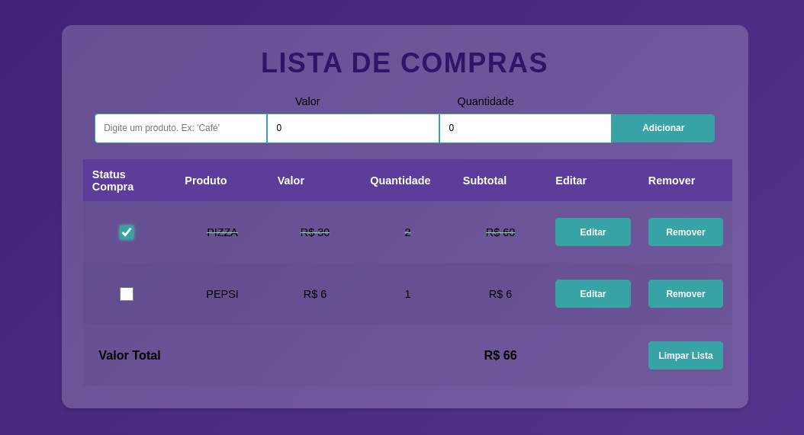

# Shopping List (Todo list) App in Angular 19,

This is a Shopping List (or to-do list), developed with the intention of practicing my Angular skills.

### Functional Requirements:
- Add a product,
- View the list of products,
- Mark a product as purchased,
- Edit or Remove a product,
- Clear the shopping list.

### Non-Functional Requirements and Styling:
- It is not possible to add an empty product,
- Subtotal and Total Value are calculated automatically,
- It is possible to mark items from the shopping list,
- The main container has a soft Glassmorphism Effect,
- The table data is are highlighted on hover.



### Skills:
- Modules export and import
- Components
- One way and Two way Data Binding
- Events
- Forms
- Conditional Render (@if / *ngIf)
- Repetition (@for / *ngFor)
- Filter and Map functions
- CRUD (Create, Read, Update and Delete)
- Conditional Styling

---

This project was generated using [Angular CLI](https://github.com/angular/angular-cli) version 19.2.4.

## Development server

To start a local development server, run:

```bash
ng serve
```

Once the server is running, open your browser and navigate to `http://localhost:4200/`. The application will automatically reload whenever you modify any of the source files.
